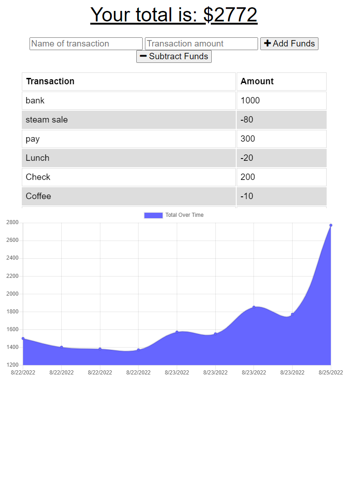

# budget-tracker

## Table of Contents

1. [Description](#description)
2. [Installation](#installation)
3. [Usage](#usage)
4. [License](#license)
5. [Contributions](#how-to-contribute)
6. [Contact Me](#contact)

## Description
This app is for avid travelers who wants to track their withdrawals, and deposits with or without a data/internet connection
so that their account balance is accurate when traveling.

USER STORY:
AS AN avid traveler
I WANT to be able to track my withdrawals and deposits with or without a data/internet connection
SO THAT my account balance is accurate when I am traveling

GIVEN a budget tracker without an internet connection
WHEN the user inputs an expense or deposit
THEN they will receive a notification that they have added an expense or deposit
WHEN the user reestablishes an internet connection
THEN the deposits or expenses added while they were offline are added to their transaction history and their totals are updated

## Installation
To install, download code from gitHub. In command line run 'npm init -y' & 'npm install' to initialize node and install required node packages. If Node is not installed in the computer, get the latest version of the app online.

## Usage
For users:

Users can add funds to their budget or substract expenses. Application displays a graph of the history of their expenses as well as a table showing each individual transaction. Users can download the applicationon their phones by clicking the download icon on the browser url. Can use without an internet connection.

For developers:

See documentation for more information on the dependencies for the application. Once server is started, or in deployed application, users can access information about the schedule of each event and ticket prices.

Features:
- Progressive Web Application, can be installed in users device
- Offline usage: API calls will be stored in cache and made once user restablishes internet connection

Technologies:

- Indexed DB
- Service Worker
- Manifest
- Node
- Express.js
- Mongo DB
- Heroku
## License

Distributed under **ISC**. See [License](https://spdx.org/licenses/ISC.html) for more information.

ISC License

Permission to use, copy, modify, and/or distribute this software for any purpose with or without fee is hereby granted, provided that the above copyright notice and this permission notice appear in all copies.

THE SOFTWARE IS PROVIDED "AS IS" AND THE AUTHOR DISCLAIMS ALL WARRANTIES WITH REGARD TO THIS SOFTWARE INCLUDING ALL IMPLIED WARRANTIES OF MERCHANTABILITY AND FITNESS. IN NO EVENT SHALL THE AUTHOR BE LIABLE FOR ANY SPECIAL, DIRECT, INDIRECT, OR CONSEQUENTIAL DAMAGES OR ANY DAMAGES WHATSOEVER RESULTING FROM LOSS OF USE, DATA OR PROFITS, WHETHER IN AN ACTION OF CONTRACT, NEGLIGENCE OR OTHER TORTIOUS ACTION, ARISING OUT OF OR IN CONNECTION WITH THE USE OR PERFORMANCE OF THIS SOFTWARE.

## Badges

## How to Contribute

To contribute to this application, make sure to fork the repository and clone it to your computer. Email me with any questions or any ideas about possible contributions. Then create a pull request for your code to be reviewed before being merged to the application.

## Tests
No test provided. Use Google Lighthouse to perform audits for performance, accessibility, PWA, and more.

## Contact

For any questions, concerns, or ideas for contributions, email me or contact me via gitHub.

**GitHub Profile:** <https://github.com/jorge30fm>

**Deployed App**:<https://blooming-sands-76583.herokuapp.com/>

**GitHub Repository:** <https://github.com/jorge30fm/budget-tracker>

**Email:** jorge30fm@gmail.com

